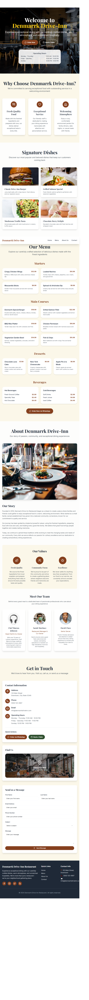

# Denmarrk Drive-Inn Restaurant

Denmarrk Drive-Inn Restaurant is a modern web application for a casual dining restaurant, built with React, Express.js, and PostgreSQL. It features a beautiful menu display, contact form, team section, and more, providing a complete digital presence for the restaurant.

## Features

- Interactive menu with starters, main courses, desserts, and beverages
- Signature dishes showcase
- About section with restaurant story and values
- Meet the team section
- Contact form with validation
- RESTful API backend
- PostgreSQL database integration (via Drizzle ORM)
- Modern UI with Tailwind CSS and shadcn/ui components
- Fast development/build with Vite

## Tech Stack

- **Frontend:** React 18, TypeScript, Wouter (routing), Tailwind CSS, shadcn/ui, TanStack Query, React Hook Form, Zod
- **Backend:** Express.js, TypeScript, Drizzle ORM, Vite (dev server)
- **Database:** PostgreSQL (Neon for production), in-memory for development

## Getting Started

1. Clone the repository:
	```sh
	git clone https://github.com/gabrielANASH/Restaurant.git
	cd Restaurant
	```
2. Install dependencies:
	```sh
	npm install
	```
3. Start the development server:
	```sh
	npm run dev
	```
4. Visit [http://localhost:5000](http://localhost:5000) in your browser.

## Project Structure

- `client/` - React frontend source code
- `server/` - Express.js backend source code
- `shared/` - Shared schema and types

## Contributing

Pull requests are welcome! For major changes, please open an issue first to discuss what you would like to change.

## License

MIT